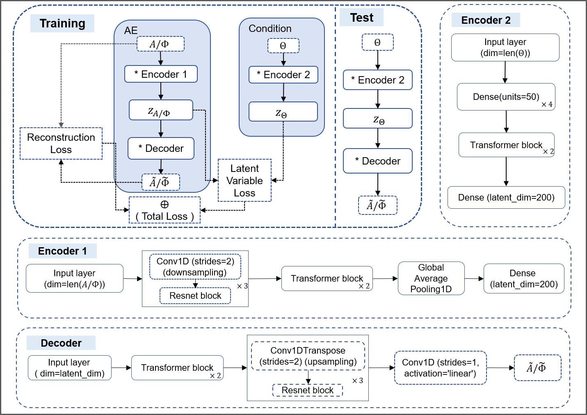

# AI_Waveform

This repository provides the source code for the paper:

**"Conditional Autoencoder for Generating Binary Neutron Star Waveforms with Tidal and Precession Effects"**

The project introduces a Conditional Autoencoder (cAE) for efficient and accurate generation of gravitational waveforms from Binary Neutron Star (BNS) mergers. It supports waveform reconstruction conditioned on physical parameters such as component masses, spins, and tidal deformabilities, and achieves high precision while maintaining strong generation efficiency.


---

## 🔧 Repository Structure

```text
AI_Waveform/
│
├── /data/                  # Waveform generation and preprocessing scripts
├── /models/                # Model architecture: encoder1, encoder2, decoder
├── /training/              # Training scripts and optimizer setup
├── /evaluation/            # Evaluation: mismatch, waveform overlap, timing tests
├── /examples/              # Sample usage: single and batch inference
├── cae_tensorflow_pseudocode.md
├── README.md
└── requirements.txt        # Environment dependencies
